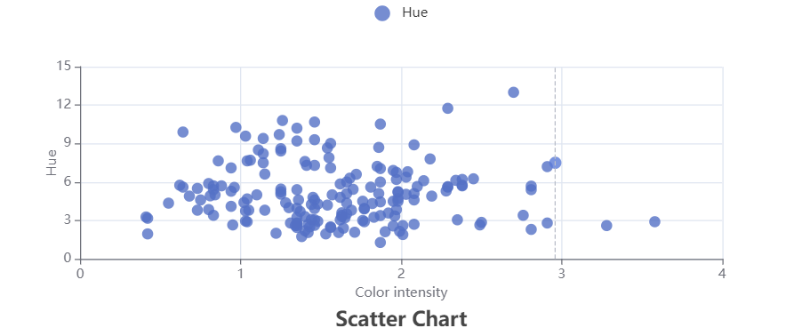

# Getting Started with Data visualization 

## Follow these ateps

- In you directory, open git bash and run:

### `git clone https://github.com/Kuldeep363/Data-visualization-React.git`;

- After cloning the project, go to project root directory and run:
### `yarn`
It will install all the dependencies

- Now inn the project root directory, you can run:

### `yarn start`

Runs the app in the development mode.\
Open [http://localhost:3000](http://localhost:3000) to view it in your browser.

The page will reload when you make changes.\
You may also see any lint errors in the console.

### `yarn build`

Builds the app for production to the `build` folder.\
It correctly bundles React in production mode and optimizes the build for the best performance.

### Scatter Chart

### Bar chart
